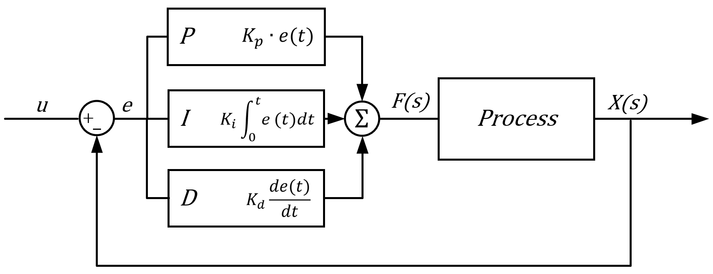
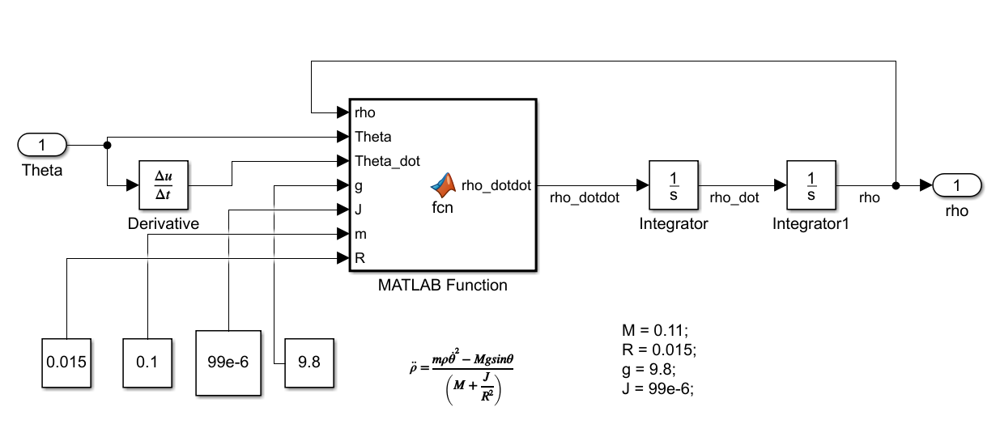
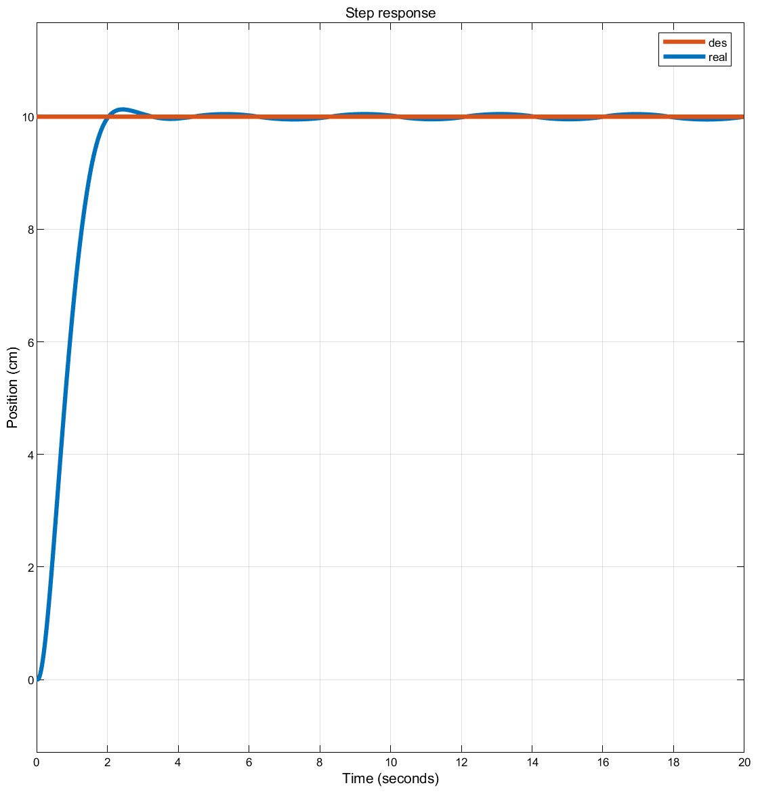
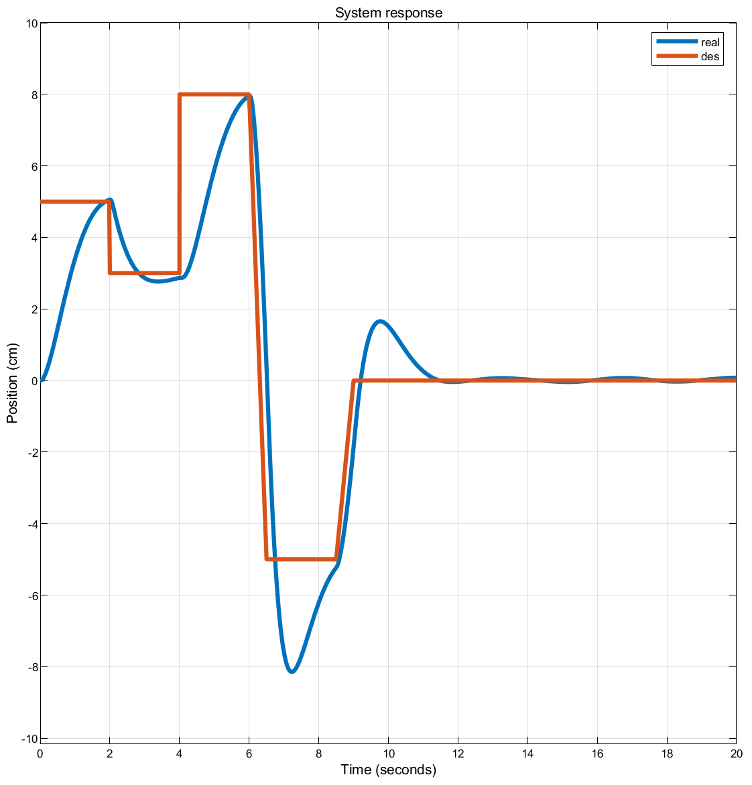
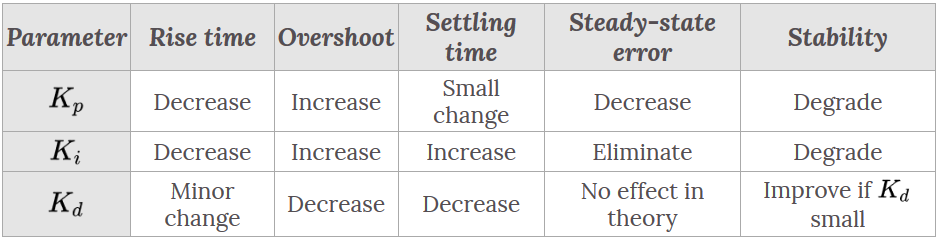
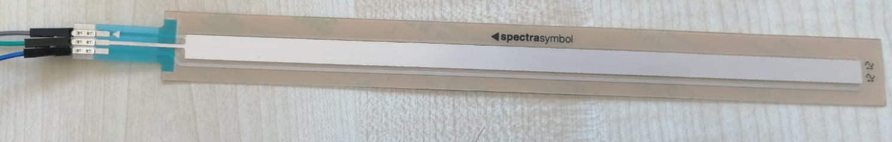
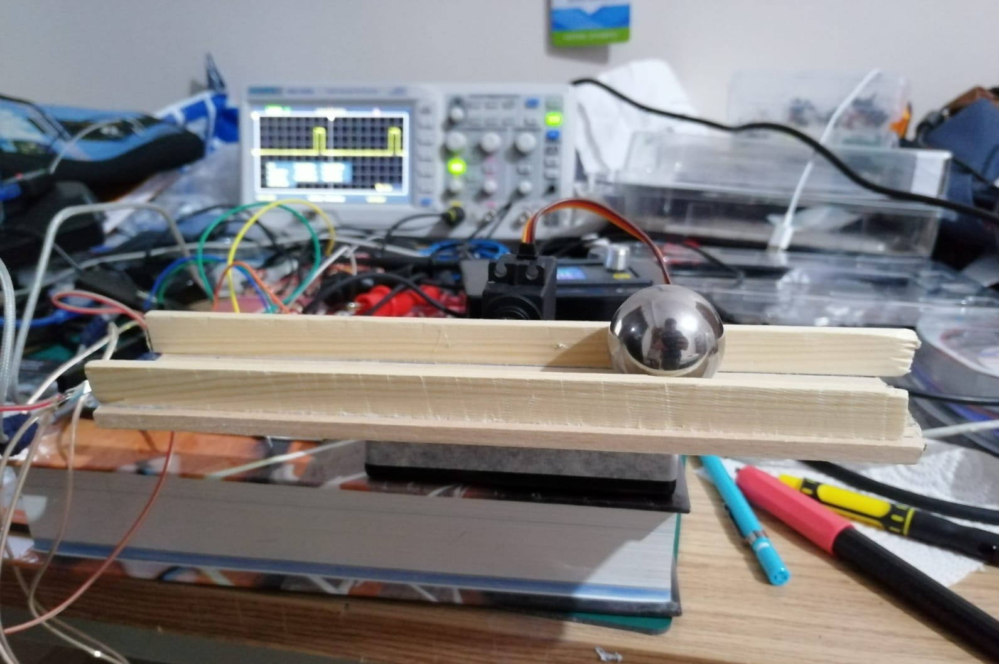

As a side project, I designed, simulated and implemented a PID (Proportional-Integral-Derivative) control system for a ball/beam configuration.

# Theory

## PID Controller

A PID controller is a system which takes the error $e(t)$ (i.e. how far away the system is from the desired state) and outputs a control signal. This control signal has the form(5):
$$
C(s) = K_p.e(t) + K_i . {\int_0^te(t)dt} + K_d . \frac{de(t)}{dt}
$$
where $C(s)$ is the control signal, $e(t)$ is the error-signal and $K_p, K_i, K_d$ are the corresponding coefficients which determine the controllers' behaviour. Intuitively, the *proportional* term adjusts the control signal according to how big the error is, the *integral* term adjusts the signal according to the past of the error, and the *derivative* term adjusts it according to how much the error has changed. Control and stability of the system is achieved by carefully tuning these parameters to meet desired operation.

{ width=40% }

## The Ball/Beam System

{ width=40% }

The ball/beam system consists of a spherical ball rolling on the beam without slipping by the force of gravity. The center of the beam is connected to an actuator which applies torque to control the position of the ball. This system is interesting because it is open-loop unstable, meaning that without a closed-loop feedback control unit it is unstable. For any non-zero angle $\theta$  of the beam, the balls position diverges to infinity.

The ball is a sphere with mass $M$ and radius $R$, $\theta(t)$ denotes the angle of the beam and $\rho(t)$ denotes the position of the ball.

I developed the physical model of the system using *Lagrangian mechanics*. Since the parameters $\theta (t)$ and $\rho (t)$ uniquely define the configuration(3), they are the *generalised coordinates*. The *Lagrangian* of the system is defined as:
$$
L = K - U \qquad (1)
$$
where $K$ is the kinetic energy and $U$ is the potential energy of the system.

The kinetic energy of the ball is
$$
K = K_{rot} + K_{tra} = \frac{1}{2}J\omega ^2 + \frac{1}{2}M v^2 \qquad (2)
$$
where $J$ is the moment of inertia, $\omega$ is the angular velocity and $v$ is the translational velocity of the ball.

The representation of $v$ in terms of the generalised coordinates is $v = \sqrt{\dot\rho^2 + (\rho\dot\theta)^2}$.

Substituting this and  $\omega^2 = (v/R)^2 = (\dot \rho/R)^2$ into $(2)$ yields:
$$
K = \frac{1}{2}J\frac{\dot\rho^2}{R^2} + \frac{1}{2}M\dot\rho^2 + \frac{1}{2}M\rho^2 \dot \theta^2 = \frac{1}{2}\left( M+\frac{J}{R^2}\right)\dot\rho^2 + \frac{1}{2}M\rho^2 \dot \theta^2 \qquad (3)
$$
The potential energy $U$ of the ball is written as:
$$
U = Mg\rho sin\theta \qquad (4)
$$
Substituting $(3)$ and $(4)$ into equation $(1)$ yields:
$$
L = \frac{1}{2}\left( M+\frac{J}{R^2}\right)\dot\rho^2 + \frac{1}{2}M\rho^2 \dot \theta^2 - Mg \rho sin\theta \qquad (5)
$$
The *Euler-Lagrange equation* is defined as(4):
$$
\frac{d}{dt}\left( \frac{\partial L}{\partial\dot\rho}\right)=\frac{\partial L}{\partial \rho} \qquad (6)
$$
Each expression is calculated as follows:
$$
\frac{\partial L}{\partial \dot\rho} = \frac{\partial \left[\frac{1}{2}\left( M+\frac{J}{R^2}\right)\dot\rho^2 + \frac{1}{2}M\rho^2 \dot \theta^2 - Mg \rho sin\theta\right]}{\partial\dot \rho} = \left( M+\frac{J}{R^2} \right) \dot \rho \qquad (7)
$$

$$
\frac{d}{dt}\left( \frac{\partial L}{\partial\dot\rho}\right) = \frac{d}{dt}\left[\left( M+\frac{J}{R^2} \right) \dot \rho \right] = \left( M+\frac{J}{R^2} \right) \ddot \rho \qquad (8)
$$

$$
\frac{\partial L}{\partial \rho} = \frac{\partial\left[\frac{1}{2}\left( M+\frac{J}{R^2}\right)\dot\rho^2 + \frac{1}{2}M\rho^2 \dot \theta^2 - Mg \rho sin\theta \right]}{\partial \rho} = M\rho\dot\theta^2 - Mgsin\theta \qquad (9)
$$

Substituting $(8)$ and $(9)$ into $(6)$ gives the governing equation:
$$
\left( M+\frac{J}{R^2} \right) \ddot \rho = M\rho\dot\theta^2 - Mgsin\theta \qquad (10)
$$
Solving for $\ddot \rho$:
$$
\ddot \rho = \frac{m\rho\dot\theta^2 - Mgsin\theta}{\left( M+\frac{J}{R^2} \right)} \qquad (11)
$$

# Modeling

To model this system I used Simulink. One can theoretically use *Simscape* to model the system physically without calculating the governing equation; but since I already had the equation I simply built a model using the *Derivative, Integrator and Function* blocks.

{ width=70% }

The system takes beam angle $\theta$ `Theta` as input and outputs the position of the ball $\rho$  `rho`. The *MATLAB Function* block simply represents the governing equation $(11)$:

```OCTAVE
function rho_dotdot = fcn(rho, Theta, Theta_dot, g, J, M, R)

rho_dotdot = ((M*rho*Theta_dot^2) - (M*g*sin(Theta))) / ...
                        (M + (J/(R^2)));
```

Also, to model the system more accurately to the real world, I simulated the servo motor which will be used in the experiment as well. The servo motor takes a PWM(Pulse Width Modulation) signal and rotates the shaft to an angle which is calculated as a function of the duty cycle of the PWM signal. The angle of the servo shaft is then measured and sent to the `ball/beam` block which outputs the position of the ball.

{ width=70% }

# Simulation

After modeling the physical and electrical components of the system, I simulated it with Simulink. As was discussed in the *Theory* section, without any control element the position $\rho$ diverges; this can be seen in Figure 32.

{ width=70% }

{ width=70% }

To control and regulate the position of the ball, I utilised a PID controller. 

{ width=70% }

Figure 33 shows the Simulink diagram for the whole simulation system. The output of the PID controller is a value between $[-60, 60]$ to represent the angle $\theta$, the `map` block converts this value to the duty cycle to be sent to the servo motor. The servo expects a 50Hz PWM signal with the duty cycle value of $\%5$ representing the leftmost angle and $\%10$ representing the rightmost. The current position of the ball $\rho$ is subtracted from the desired value to find the error $e$, which is then fed into the PID controller. Since the widely-known *Ziegler-Nichols Method* does not work inherently unstable processes, I decided to manually tune the parameters. By trial and error, I found parameters $P=200, I=1, D= 150$ to be acceptable in aspects of rise-time, steady-state error and overshoot.

{ width=50% }

Figure 34 shows the step response of the controlled system, where `des` is the _desired_ step signal and `real` is the real-time position of the ball. As can be seen, the rising time is about *2 seconds* with an overshoot of less than *2 mm*.

{ width=50% }

Figure 35 shows the system response to a more complicated input signal. As can be seen, the system relatively successfully follows the desired position, with overshoots happening because of large transitions. These overshoots can be minimised at the cost of increased rising-time by increasing the $D$ coefficient. In general, effects of modifying the coefficients independently is described as(6):

{ width=50% }

# Hardware Implementation

To implement this system I needed an actuator to control the angle and a sensor to measure the balls current position. I used a MG 995 high-power servo motor for the actuator. A servo motor is a motor whose shaft angle can be controlled by a PWM signal. With a frequency of 50 Hz, a %7.5 duty-cycle corresponds to the neutral position whereas %5 and %10 correspond to the maximum angles.

{ width=30% }

As a sensor, after experimenting with various options such as ultrasonic and laser *ToF* *(Time of Flight)* sensors, I decided on a linear touch potentiometer called *SoftPot*(7). 



It is a "linear soft membrane potentiometer used for tracking position and acquiring the preferred output in a variety of applications(7)". The softpot is connected as shown in Figure 39. The version I bought is $200 mm$ long with a resistance of $20k\Omega$.

{ width=30% }

The output voltage at the `DATA` pin varies linearly from $0V$ to $5V$ according to where the potentiometer is pressed on. I can directly use this voltage to determine the position of the ball.

As a micro controller I used the NXP *DEVKIT-MPC5744P* which is a development board for the 32-bit *MPC5744P* MCU. The main reasons I used this particular unit is that it has an extensive *Model-Based Design Toolbox* for *Simulink* and it features a 12-bit ADC and 16-bit hardware PWM which have a degree of precision required by the control system I designed.

{ width=50% }

## Experiment Setup

Figures 41 and 42 show the hardware implementation setup. A wooden canal is constructed so that the steel ball can move on top of the beam. The softpot is glued to the base so that it can measure the ball's position. The board is powered externally since the built-in voltage regulator cannot handle the high current required by the high power servo motor. A 100ohm resistor is placed between the PWM output and the servo motor control signal to act as a current-limiter.

{ width=50% }

{ width=50% }

## Simulink Model


The position of the ball is read from the SoftPot via the ADC which is then mapped into a range of $[-100, +100]$. The desired position value $0$ gets subtracted from this value and fed into the PID controller. The PID controller outputs a value in the range $[-45, +45]$ representing the angle $\theta$ which is then mapped into the duty cycle value in the range $[0.06, 0.09]$ for the outermost angles of the servo motor. This duty cycle value is fed into the PWM generator which outputs a $50 Hz$ PWM signal with the given pulse-width.

## Results

I used an oscilloscope to make sure that the PWM signal was in the correct form. As can be seen on Figure 44, it is indeed a 50Hz signal with the duty-cycle in the range $[0.06, 0.09]$.

{ width=50% }

Using FreeMASTER, which is a real-time debug software for the board, I observed the values for the ADC, the angle output of the PID, the duty-cycle and the current position of the ball.


By plotting the position of the ball, I could observe the characteristics of the designed control system.


As can be seen on Figure 46, when the ball is dropped at -70mm, the position gets corrected to stabilise around the middle of the beam. There are steady-state oscillations probably caused by the servo motor or the inaccuracies of the sensor.

The video of the experiment can be found at: https://youtu.be/lyxPgjbJB_w