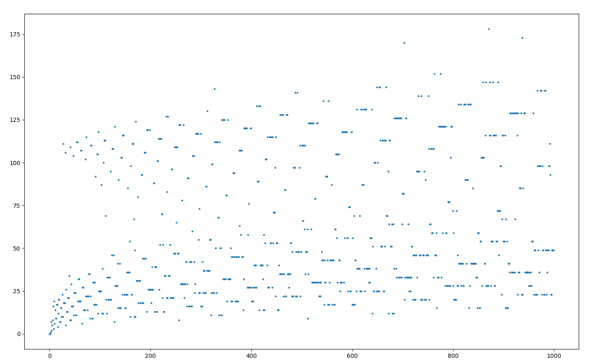
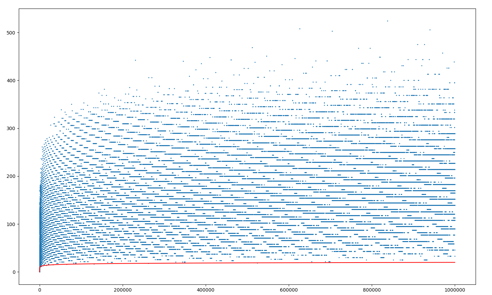
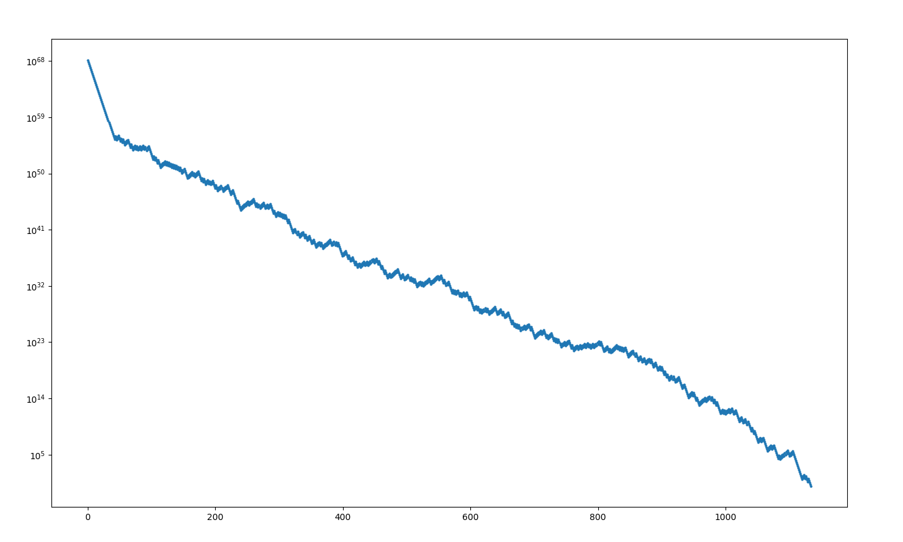

# Problem

[The Collatz Conjecture](http://mathworld.wolfram.com/CollatzProblem.html) is a problem posed by L. Collatz in 1937. Take a positive integer. If it is even, divide it by two. If it is odd, multiply by 3 and add 1. The conjecture states that if you iterate this process for _any_ positive integer, you will always reach $1$. So if we take the function:

$$
f(x) = \begin{cases}
        \frac{x}{2} \qquad \text{for } x \text{ even} \\
        3x+1 \quad \text{for } x \text{ odd}
        \end{cases}
$$

and iterate it for any positive integer $n$, we will always reach $1$.

For example for $7$, this looks like:

$$
7 \rightarrow 22 \rightarrow 11 \rightarrow 34 \rightarrow 17 \rightarrow 52 \rightarrow 26 \rightarrow 13 \rightarrow 40 \rightarrow 20 \rightarrow 10 \rightarrow 5 \rightarrow 16 \rightarrow 8 \rightarrow 4 \rightarrow 2 \rightarrow 1
$$

# Requirements

## numpy

I will be using [NumPy](http://www.numpy.org) to build the arrays. NumPy has optimized calculation routines for its fundamental array data structure, which makes it great for scientific computing. It can be installed via `pip install numpy`.

## matplotlib

[matplotlib](https://matplotlib.org) is an awesome 2D plotting library which we will use to visualize the data. It can similarly be installed via `pip install matplotlib`.

# Code

We can write two python functions to analyze this conjecture. The first function, `collatzer()` will take the positive integer and return the number of steps it took to reach 1. The second function, `collatzer_steps()`, will take the positive integer and return the values of the iteration.

```python
import numpy as np

def collatzer(i):
    count = 0
    while i > 1:
        if i % 2 == 0:
            i = i // 2
        else:
            i = (3 * i) + 1
        count = count + 1
    return count

def collatzer_steps(i, dtype=int):
    i = int(i)
    steps = [i]
    while i > 1:
        if i % 2 == 0:
            i = i // 2
            steps.append(i)
        else:
            i = (3 * i) + 1
            steps.append(i)
    if dtype == int:
        return np.array(steps, dtype=np.int64)
    else:
        return np.array(steps, dtype=float)
```
Note the usage of `numpy` arrays since they tend to be more efficient. Also the `collatzer_steps()` function uses `ìnt64` type by default but can also use `float`. This is because `int64` overflows at very large numbers. The outputs are as follows:


```python
>>> from Collatz import *
>>> collatzer(7)
16
>>> collatzer_steps(7)
array([ 7, 22, 11, 34, 17, 52, 26, 13, 40, 20, 10,  5, 16,  8,  4,  2,  1])
```

Now we are ready to analyse the conjecture. Let us look at the first 1000 numbers and see how many steps each take to reach 1.

```python
import matplotlib.pyplot as plt
import numpy as np
from Collatz import *
from timeit import default_timer as timer

start = timer()
limit = 1000
y = np.zeros(limit, dtype=int)
x = np.arange(limit, dtype=int)
for n in x:
    y[n] = collatzer(x[n])
fig, ax = plt.subplots()
ax.plot(x, y, '.', ms=4)
end = timer()
print(end-start)
plt.show()
```
By using the `timeit` module, we can see that the whole calculation took about 140ms. Here is the plot:



It looks like two streams coming from 0 and somehwere between 100-120 to meet with another. We can also see peculiarly straight horizontal lines.

For perspective, let's plot the first million numbers, along with the function $log_{2} x$. This function is particularly interesting because for any power of $2$, $log_{2} x$ is the number of the steps it takes to reach $1$. In other words, the number $2^n$ reaches $1$ in $n$ steps. Modifying the code a little bit, and using `np.savetxt()` to dump the data for future use, we observe that the operation took 147 seconds for the first million numbers.

```python
import matplotlib.pyplot as plt
import numpy as np
from collatz import *
from timeit import default_timer as timer

start = timer()
limit = 1000000
col_y = np.zeros(limit, dtype=int)
log_y = np.zeros(limit)
x = np.arange(limit, dtype=int)
for n in x:
    col_y[n] = collatzer(x[n])
    log_y[n] = np.log2(x[n])
log_y[0] = 0  # because log2(0) gives -inf
fig, ax = plt.subplots()
ax.plot(x, col_y, '.', ms=2)
ax.plot(x, log_y, 'r')
end = timer()
print(end-start)
np.savetxt('collatz_plot_1M.txt', col_y, fmt='%d')
plt.show()
```



We can observe that the function $log_{2} x$ acts as a lower bound for the number of steps, and the figure reaches horizontal stability except for some outliers.

Just to utilize the `collatzer_steps()` function, let us see the steps a very large number takes. Since the y axis starts off quite high and diminishes rather quickly, I will use a $\log y$ axis.

```python
import matplotlib.pyplot as plt
import numpy as np
from collatz import *

number = 42 ** 42
y = collatzer_steps(number, dtype=float)
x = np.arange(len(y))
fig, ax = plt.subplots()
plt.semilogy(x, y, '.', ms=4)
plt.show()
```


# Downloads

[collatz.py](files/collatz.py)

[collatz_plot_1K.py](files/collatz_plot_1K.py)

[collatz_plot_1M.py](files/collatz_plot_1M.py)

[collatz_plot_1M.txt](files/collatz_plot_1M.py)

[collatz_steps_plot.py](files/collatz_steps_plot.py)