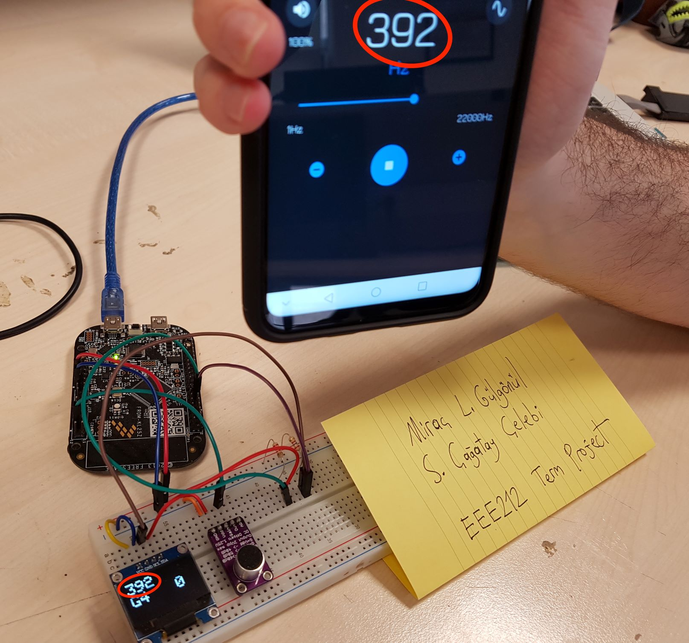
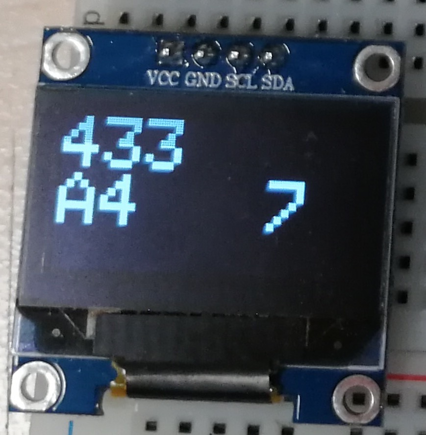

# Introduction

As a term project, we designed and implemented a guitar (or any instrument) tuner device using the FRDM-KL25Z board, a microphone and an OLED display. The tuner reads the sound from the microphone, breaks down the signal into its frequency components, displays the frequency with the most amplitude (the base frequency), and also displays the closest musical note to that frequency, indicating whether the instrument should be tuned up (higher pitch) or tuned down (lower pitch) to match that closest musical note. An analog microphone is used to capture the input audio signal, the FRDM-KL25Z board acts as the digital signal processor, and a 128x64 OLED screen displays the user interface.


# Theory

By using Discrete Fourier Transform (DFT), one can decompose a sampled discrete digital signal into a coefficient matrix which represent the required "weights" to reproduce the sampled signal; provided that the sampling frequency $F_s$ is equal or greater than the bandwidth $B$ of the input signal (due to *Nyquist–Shannon sampling theorem*). A typical guitar can produce sounds ranging from the note $C2$ (65.41 Hz) to $F4$ (349.23 Hz). To round things off, a sampling frequency of $1000 \text{ Hz}$ will suffice to correctly analyse sounds up to $B4$ (493 Hz). The incoming sound signal $x[t]$ will be transformed into the frequency domain $X[jw]$. Then the magnitudes of these complex coefficients will be calculated to produce $|X[jw]|$. Since the guitar sound contains many harmonics, the frequency with the highest magnitude will be extracted, and compared with the closest musical note.


# Work Done

## Setup

The analog output of the microphone is connected to the board (via the `PTC2` port) and the OLED screen is connected to the board to enable I2C (Inter-Integrated Circuit) communications which allows us to display the characters on the screen.

| Board Pins | OLED Display | Microphone |
| --- | --- | --- |
| PTC2 | - | Out|
| PTC8 | SCL | - |
| PTC9 | SDA | - |


## Code

The code itself is at Appendix A; this section describes the behaviour.

### Libraries

We will be using the `mbed` environment to program the board. The library `mbed-dsp` contains functions `arm_cfft_f32()` and `arm_cmplx_mag_f32()` to calculate the Fourier transform and magnitudes of complex numbers respectively. The library `FastAnalogIn` is used to sample the input pin at the sampling frequency and read the input signal as an array of 512 elements. The library `Adafruit_GFX` enables us to draw shapes and text on the OLED screen.

### Operation

The array `float samples[FFT_SIZE*2]` holds the samples read at each loop (note that the size is `FFT_SIZE*2` because we need two elements for each complex coefficient). Then the function `arm_cfft_f32()` is called with this array, overwriting it with the complex coefficients $a, b$. The function `arm_cmplx_mag_f32()` processes this array to calculate the magnitudes of these complex coefficients, putting them in an array of type `float magnitudes[FFT_SIZE]`. The index of the maximum element in this array corresponds to the base frequency of the input audio signal. The closest musical note to this frequency is calculated from a lookup table and the difference is stored to be displayed. To eliminate possible noise, these values are displayed once every 1024 loop: this trivially reduces response time, but greatly increases the overall accuracy of the system.



## User Interface

The screen shows to the user the current frequency of the signal in the first row, the second row shows the closest musical note, and how far away it is. *Figure 4* shows an example scenario: the input signals frequency is *433 Hz*, the closest musical note to this frequency is **A4**, which is *440 Hz* so the user has to tighten the string to increase the frequency by **7 Hz**. 



# Differences Between Proposal and Work Done

There exists two minor differences between the final product and the proposal. The *FRDM-KL25Z* board uses the *Cortex-M0+* architecture, which imposes a hardware limit on the biggest FFT size (512 bins): since we are using a sampling rate of *1000 Hz* this means a resolution of $1000/512 = 1.95312$. As a result the sensitivity is about $\pm 1$ Hz.

Also, the user interface is visually different than the proposed one because of the limitations of the library `Adafruit_GFX` and the size of the OLED screen *(128x64)*. Nevertheless the relevant information is legibly displayed on the screen.

# Conclusion

All together, each group member spent about 12 hours for a total of 24. Group member *Miraç L. Gülgönül* was tasked with the audio processing tasks: reading the signal from the pin with the sampling rate, calculating the DTFT(Discrete-Time Fourier Transform) of the signal and finding the corresponding frequency with the biggest amplitude. Group member *S. Çağatay Çelebi* was tasked with interfacing with the OLED screen using the libraries: displaying the frequency, the musical note and the distance from the musical note.

This process was informative in various aspects such as collaborative coding and division of labor. Also, the coding environment provided by the `mbed` platform was very different from coding in `8051-Assembly`. The code was easier to read, we could do debugging and we could divide the code to components more easily. Obviously each paradigm has its advantages: `Assembly` allows for more compact and bare metal coding whereas `C++` provides more abstraction and ease of coding: however at the modern age we believe that programmer time is more important than processing time.

# Appendices

## Appendix A

```CPP
/* Instrument tuner using the FRDM-KL25Z Board. Written for EEE212 Term Project.
 * Miraç L. Gülgönül - S. Çağatay Çelebi
 * 20 May 2019
 */

#include "mbed.h"
#include "NVIC_set_all_priorities.h"
#include <ctype.h>
#include "arm_math.h"
#include "arm_const_structs.h"
#include "FastAnalogIn.h"
#include "TextLCD.h"
#include <algorithm>
#include <string>
#include "Adafruit_GFX.h"
#include "Adafruit_GFX_Config.h"
#include "Adafruit_SSD1306.h"
#include "glcdfont.h"

using namespace std;

I2C comms(PTC9, PTC8);

Adafruit_SSD1306_I2c oled(comms, PTC3, 0x78, 64, 128);

FastAnalogIn   Audio(PTC2); // INPUT

// Dummy ISR for disabling NMI on PTA4.
// More info at https://mbed.org/questions/1387/How-can-I-access-the-FTFA_FOPT-register-/
extern "C" void NMI_Handler()
{
    DigitalIn test(PTA4);
}


// A guitar is at max from C2 to F4: which gives 65.41Hz to 349.23Hz
// Supported highest freq is 493 Hz, B4.
const int SAMPLE_RATE_HZ = 1000;
const int WINDOW_SIZE = 1024; // WAS 1024
const int NOTE_SIZE = 39;
float max_amp = 0;
int max_idx = 0;
int max_idxs[WINDOW_SIZE];
int window_idx = 0;
const int FFT_SIZE = 512; // Size of the FFT.

const char * const notes[NOTE_SIZE] = {
    "A1", "A#1", "B1", "C2", "C#2", "D2", "D#2", "E2", "F2", "F#2", "G2", "G#2",
    "A2", "A#2", "B2", "C3", "C#3", "D3", "D#3", "E3", "F3", "F#3", "G3", "G#3",
    "A3", "A#3", "B3", "C4", "C#4", "D4", "D#4", "E4", "F4", "F#4", "G4", "G#4",
    "A4", "A#4", "B4",
};

const int note_freqs[NOTE_SIZE] = {
    55, 58, 62, 65, 69, 73, 78, 82, 87, 92, 98, 103, 110, 116, 123,
    131, 139, 147, 156, 165, 175, 185, 196, 208, 220, 233, 246, 261,
    277, 294, 311, 330, 349, 370, 392, 415, 440, 466, 493
};

int differences[39];
int min_diff = 1000;
int min_diff_idx = 10;
string closest_note = notes[min_diff_idx];

const static arm_cfft_instance_f32 *S;
Ticker samplingTimer;
float samples[FFT_SIZE*2];
float magnitudes[FFT_SIZE];
int sampleCounter = 0;


////////////////////////////////////////////////////////////////////////////////
// SAMPLING FUNCTIONS
////////////////////////////////////////////////////////////////////////////////

void samplingCallback()
{
    // Read from the ADC and store the sample data
    samples[sampleCounter] = (1023 * Audio) - 511.0f;
    // Complex FFT functions require a coefficient for the imaginary part of the input.
    // Since we only have real data, set this coefficient to zero.
    samples[sampleCounter+1] = 0.0;
    // Update sample buffer position and stop after the buffer is filled
    sampleCounter += 2;
    if (sampleCounter >= FFT_SIZE*2) {
        samplingTimer.detach();
    }
}

void samplingBegin()
{
    // Reset sample buffer position and start callback at necessary rate.
    sampleCounter = 0;
    samplingTimer.attach_us(&samplingCallback, 1000000/SAMPLE_RATE_HZ);
}

bool samplingIsDone()
{
    return sampleCounter >= FFT_SIZE*2;
}


////////////////////////////////////////////////////////////////////////////////
// MAIN FUNCTION
////////////////////////////////////////////////////////////////////////////////

int main()
{
    NVIC_set_all_irq_priorities(1);
    NVIC_SetPriority(UART0_IRQn, 0);
    oled.setTextSize(3);
    // Begin sampling audio
    samplingBegin();

    S = & arm_cfft_sR_f32_len512;

    while(1) {

        // Calculate FFT if a full sample is available.
        if (samplingIsDone()) {
            // Does a Hanning on samples:
            for (int i = 0; i < FFT_SIZE*2; i++) {
                if (i % 2 == 0) {
                    samples[i] = samples[i] * (1-cos(2*3.141592653589793/(FFT_SIZE)));
                } else {
                    samples[i] = 0.0;
                }
            }
            // Run FFT on sample data.
            arm_cfft_f32(S, samples, 0, 1);
            // Calculate magnitude of complex numbers output by the FFT.
            arm_cmplx_mag_f32(samples, magnitudes, FFT_SIZE);

            // Restart audio sampling.
            samplingBegin();
        }

        max_amp = 0;
        max_idx = 0;

        for(int i = 1; i < FFT_SIZE; i++) {
            if(magnitudes[i] > max_amp && i < 256) {
                max_amp = magnitudes[i];
                max_idx = i;
            }
        }

        max_idxs[window_idx] = max_idx;

        if(window_idx == WINDOW_SIZE - 1) {
            window_idx = 0;
            // sorts the array
            sort(max_idxs, max_idxs+100);

            // finds the most repeated element
            int repeat = max_idxs[0];
            int mode = repeat;
            int mode_freq = mode;
            int count = 1;
            int count_mode = 1;

            for(int i = 1; i < WINDOW_SIZE; i++) {
                if(max_idxs[i] == repeat) {
                    ++count;
                } else {
                    if(count > count_mode) {
                        count_mode = count;
                        mode = repeat;
                    }
                    count = 1;
                    repeat = max_idxs[i];
                }
            }
            mode_freq = static_cast<int>(floor(mode*1.953125)); // for FFT_SIZE = 512, Fs = 1000.

            for(int i = 0; i < NOTE_SIZE; i++) {
                differences[i] = mode_freq - note_freqs[i];
            }

            min_diff = 1000;
            min_diff_idx = 10;

            for(int i = 0; i < NOTE_SIZE; i++) {
                if(abs(differences[i]) < min_diff) {
                    min_diff = differences[i];
                    min_diff_idx = i;
                }
            }

            closest_note = notes[min_diff_idx];
            char mode_freq_str[10];
            char closest_note_char[10];
            char min_diff_char[10];

            sprintf(closest_note_char, "%s", closest_note);
            sprintf(mode_freq_str, "%d", mode_freq);
            sprintf(min_diff_char, "%d", -1*min_diff);

            oled.clearDisplay();
            oled.setTextCursor(0,0);

            for(int i = 0; i < 3 ; i++) {
                oled.writeChar(mode_freq_str[i]);
            }
            oled.writeChar('\n');

            for(int i = 0; i < 3 ; i++) {
                oled.writeChar(closest_note_char[i]);
            }
            oled.writeChar(' ');
            oled.writeChar(' ');


            for(int i = 0; i < 2 ; i++) {
                oled.writeChar(min_diff_char[i]);
            }

            oled.display();

        } else {
            window_idx = window_idx + 1;
        }
    }
}
```


