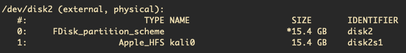
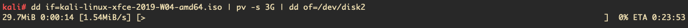
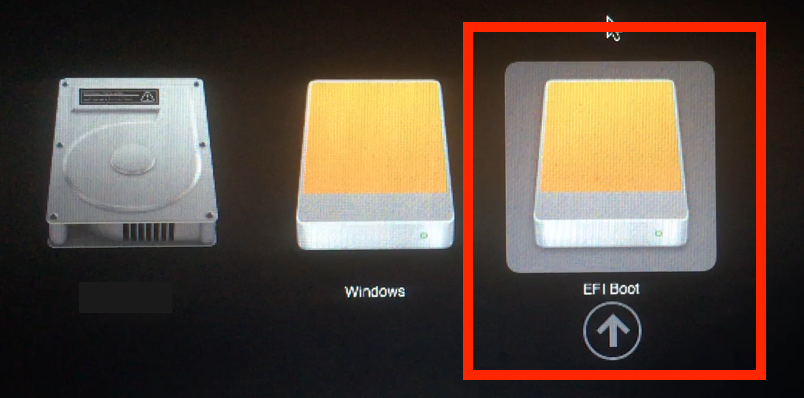
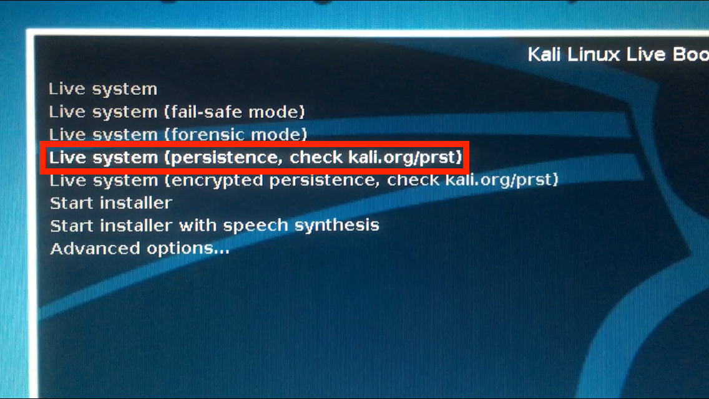
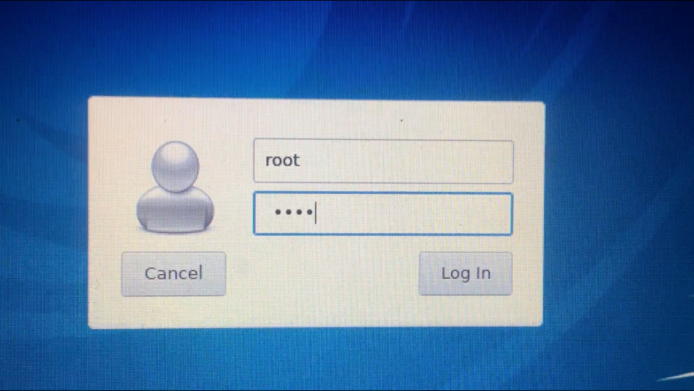
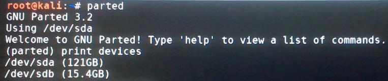
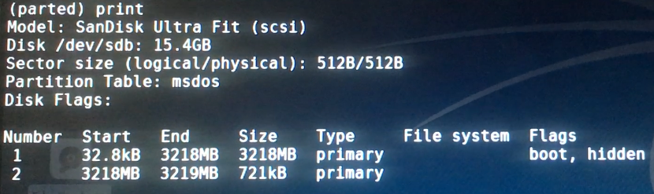
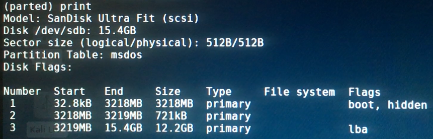

In this post I will show you how to setup a Kali GNU/Linux Live system with _persistence_ on a USB drive, so that you can carry it around anywhere and boot from it whenever you want to. The _persistence_ feature will allow the system to be saved and persist through different boot-ups. As the [official documentation](https://docs.kali.org/downloading/kali-linux-live-usb-persistence) suggests: _" (...) the preservation of data on the “Kali Live” USB drive — across reboots of “Kali Live”. This can be an extremely useful enhancement, and enables you to retain documents, collected testing results, configurations, etc., when running Kali Linux “Live” from the USB drive, even across different systems."_

I will be doing this on a MacBook Air (13-inch, Early 2014) with macOS Mojave 10.14.1 installed, so your mileage may vary on another system.

_NOTE: You will notice that I have paid attention to use the correct form "GNU/Linux" through this article. See [Linux and the GNU System](https://www.gnu.org/gnu/linux-and-gnu.en.html) by [Richard Stallman](http://www.stallman.org) for why this is an issue._

# Requirements

## USB Drive

The full version of the _Kali GNU/Linux ISO_ takes about 3GB, so theoretically any USB drive with larger capacity should work. I will be using a 16GB SanDisk.

## Kali Linux ISO

You will need the _.iso_ file of the Kali GNU/Linux variant you want to use. I recommend the [XFCE](https://www.xfce.org) version of the latest weekly build (the "official" releases can sometimes fall behind, which causes problems with the version of the included Linux kernel). The weekly build _.iso_ files can be downloaded from [here](http://cdimage.kali.org/kali-images/kali-weekly/).

## balena Etcher (Optional)

You can do the flashing with the built-in command `dd`, but I have found [balena Etcher](https://www.balena.io/etcher/) to be faster. Also `dd` is a bit dangerous to use, you can overwrite crucial files if you are not careful.

# Flashing

After downloading the _.iso_ file, it is always good practice to check the `shasum` to avoid cases of files corrupted on transfer. On the [kali-weekly download page](http://cdimage.kali.org/kali-images/kali-weekly/), the file called `SHA256SUMS` contains the [SHA-256](https://en.wikipedia.org/wiki/SHA-2) codes for the _.iso_ files provided. You can check the `SHA256SUM` of your downloaded _.iso_ file with the command `shasum -a 256 YOUR_KALI.iso` and compare it with the checksum provided. In my case I am using the `kali-linux-xfce-2019-W04-amd64.iso` file, and as you can see, the checksums match.

```bash
~$ shasum -a 256 kali-linux-xfce-2019-W04-amd64.iso
b15508aaf84b30b7e606289f7e9524393c54798cde2011d0e24db57cde2e5fe6  kali-linux-xfce-2019-W04-amd64.iso
~$ cat sha256sums.txt
(...)
b15508aaf84b30b7e606289f7e9524393c54798cde2011d0e24db57cde2e5fe6  kali-linux-xfce-2019-W04-amd64.iso
(...)
```
Now that we have ensured the integrity of the file, it is time to flash it. If you are using _balena Etcher_, all you have to do is select the _.iso_ file and the USB to be flashed on the GUI.

If you are using `dd`, then you have to first identify your USB drive. It is also recommended to do a `sudo su` beforehand because most of the commands require root privileges. `diskutil list` will show the disks attached to your MacBook.



As you can see, I can identify my 16GB SanDisk USB as `/dev/disk2`. Now that you know your disk's path, you will have to unmount it by `diskutil unmountDisk /dev/disk2`. We can finally flash the _.iso_ file. The `dd` command by default by itself doesn't have a progress bar, so if you want one you will have to install [pv](https://linux.die.net/man/1/pv) on your macOS by `brew install pv`. Using `pv`, we can pipe the `dd` commands through it to monitor the progress. The command

`dd if=kali-linux-xfce-2019-W04-amd64.iso | pv -s 3G | dd of=/dev/disk2 bs=4m`

will start flashing the iso file to your selected drive; and show you a progress bar/ETA. **BE VERY CAREFUL** to enter the correct paths to your _.iso_ file and more importantly the target disk. Also note that the `-s 3G` provides the file size to be used in calculating the ETA. Finally, you can increase the _batch size_ `bs` to increase the speed, but I have found `bs=4m` to be stable.



## Booting

After the flash process is complete, you will boot to your USB by rebooting your MacBook. Make sure to hold the OPTION KEY - ⌥ while your computer is starting up to enter the [Startup Manager](https://support.apple.com/en-us/HT202796). You will be presented with disks to boot from. The exact names on your screen _might_ vary, but the Kali GNU/Linux USB is likely to be named *EFI Boot*.

{ width=50% }

Booting from your Kali GNU/Linux USB drive, you will be presented with the Kali boot up screen. From this screen choose *Live system (persistence, check kali.org/prst)*.

{ width=50% }

On _XFCE_, you will presented with the login screen below. The default user is `root` with the password `toor`; so you can log in with those.

{ width=50% }

## Partitioning

Now that you are booted up on Kali GNU/Linux Live, you will have to create a partition to put the _persistence_ configuration files.

Start by opening up a _Terminal_ and enter `parted`,[a program for creating and manipulating partition tables](https://wiki.archlinux.org/index.php/Parted). Enter `print devices` to print out the disks attached to your notebook (just like `diskutil list`). You will again have to identify the attached USB disk (which we have just booted from). In my case, it is `/dev/sdb`.



Enter `select /dev/sdb` to work on the USB drive (which will helpfully print `"Using /dev/sdb"`). Enter `print` to list the info about the drive.



As you can see, the Kali GNU/Linux _.iso_ file takes about 3GB, while the rest is free space which we will use to store the persistence data. Noting exactly where the second partition ends, entering `mkpart primary END_OF_PART_2 -1` will create a partition filling up the rest of the drive. So in my case the command is `mkpart primary 3219 -1`. Entering `print` again will confirm that the partition is created. Enter `quit` to exit `parted`.



## Persistence

Now that we have created the partition, we can finally setup _persistence_. Noting the number of the partition we have just created (which was `3` in my case), the command `mkfs.ext4 -L persistence /dev/sdb3` will create a [EXT4](https://opensource.com/article/17/5/introduction-ext4-filesystem) filesystem in the partition, and label it. The command `e2label /dev/sdb3 persistence` will label the filesystem again as *persistence*. (Make sure to replace `/dev/sdbX` with your partition's number in these commands.)

As the last step, we will have to create a _persistence.conf_ file in the USB drive. To do so, you have to create a mounting point with the command `mkdir -p /mnt/kali`. Then mount your partition with the command `mount /dev/sdb3 /mnt/kali`. The command `echo "/ union" > /mnt/kali/persistence.conf` will create the config file containing the line _"/ union"_. You are finally done! Upon reboot, you will have a ready-to-rock Kali GNU/Linux Live system.

# Extras

## Wi-Fi

If you are using the Kali GNU/Linux Live system on a MacBook, you will notice that the system will not automatically recognize the built-in Wi-Fi driver. This because the _Broadcom_ chip on your MacBook has a proprietary driver which is not installed on Kali GNU/Linux by default. If you want to be able to use the built-in Wi-Fi driver, entering `sudo apt install broadcom-sta-dkms` will download and install the driver. To remove possible conflictions with other drivers, enter `modprobe -r b44 b43 b43legacy ssb brcmsmac`. Finally, the command `modprobe wl` should initialise the driver.

## Bluetooth

Fortunately the driver for the built-in Bluetooth chip on most MacBooks is already installed by default. To enable _Bluetooth_ on a _XFCE_ system, enter `sudo apt install bluetooth blueman`. Then enter `/etc/init.d/bluetooth start` to start the _Bluetooth_ service. The command `blueman-manager` will open the Bluetooth manager so that you can connect your devices.

# Resources

I would like to extend my gratitude towards the authors of the following website articles.

[https://docs.kali.org/downloading/kali-linux-live-usb-persistence](https://docs.kali.org/downloading/kali-linux-live-usb-persistence)

[https://kali.training/topic/adding-persistence-to-the-live-iso/](https://kali.training/topic/adding-persistence-to-the-live-iso/)

[https://null-byte.wonderhowto.com/how-to/install-kali-live-usb-drive-with-persistence-optional-0162253/](https://null-byte.wonderhowto.com/how-to/install-kali-live-usb-drive-with-persistence-optional-0162253/)

$\space$
