Using MATLAB/Simulink, one is able to design and simulate a complete communications system including various components. A theoretical communication system can be described as a block diagram:

{ width=50% }

# The Transmitter

The transmitter consists of a signal source which generates random bitstream, a modulator to map this bitstream into complex *symbols*, pulse-shaping to filter this digital signal, and optionally an up-converter to embed these symbols into a carrier frequency.

## Signal Source

When designing a communications system, it is often good practice to test it with a random message. I generated a random bitstream (a random message of `1`s and `0`s) and visualised the first 50 bits as follows:

```OCTAVE
numBits = 100000;
txBits  = randi([0 1], numBits, 1);

stairs(txBits(1:50), 'bo-')
axis([0 50 -0.5 1.5]);
title('\bfRandom bit stream');
```
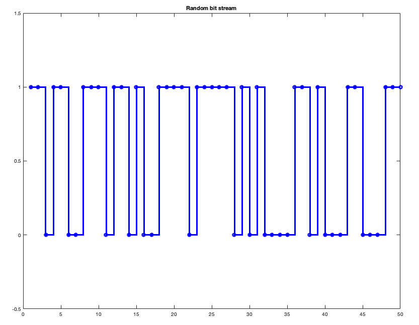{width=50%}

## Digital Modulator

To modulate the bitstream into *symbols*, I used *QPSK(Quadrature Phase Shift Keying)* modulation. This modulation technique transmits 2 bits per symbols, so it maps each 2 bits of the incoming bitstream into a corresponding *symbol*. As the name suggests, the modulator modulates the phase of the carrier signal into 4 distinct phases. For instance, `00` corresponds to a phase shift of $\pi/4$ and `01` to a phase shift of $3\pi/4$.

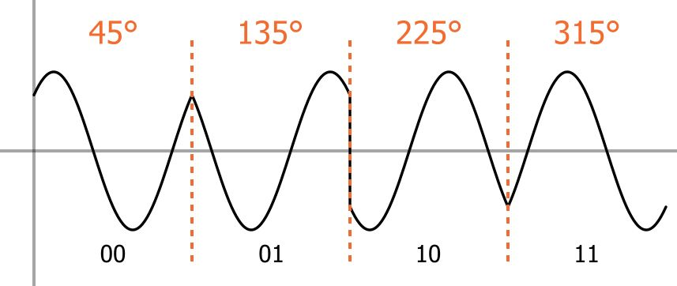{width=50%}

To better represent these phase shifts, I used a *constellation diagram*. Each phase shift is represented on the complex coordinate system, so they can be represented as a complex *symbol* in the form of $a+bj$.

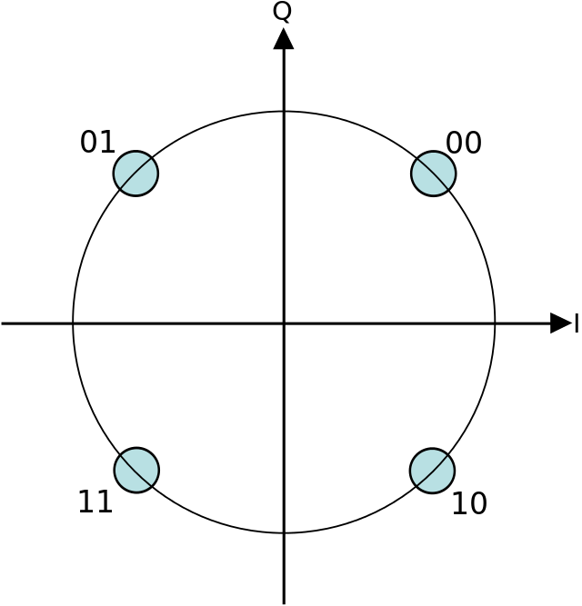{width=30%}

In MATLAB, I can do this via system objects as:

```OCTAVE
hMod = comm.QPSKModulator;
hMod.BitInput = true;
txSymbols = hMod(txBits);

```
The variable `txSymbols` now holds the complex *symbols* generated by the modulator. Here are the the first 5 elements:
```OCTAVE
>> txSymbols(1:5)
>> 
ans =

  -0.7071 - 0.7071i
  -0.7071 + 0.7071i
  0.7071 - 0.7071i
  -0.7071 + 0.7071i
  -0.7071 - 0.7071i

```

However, it is better to use a constellation diagram to visualise these symbols. This is done by:

```OCTAVE
hConst = comm.ConstellationDiagram;
hConst.ReferenceConstellation = [1+1j -1+1j -1-1j 1-1j]/sqrt(2);
hConst(txSymbols)
```

{width=50%}

As can be seen in *Figure 6*, each two bits of the message is mapped to one of the 4 symbols; which are complex numbers with magnitude $1$ and have a phase shift of $\pi/2$ between them.

## Pulse Shaping

To transmit these symbols, one first needs to pass them through a filter. This is because currently these symbols represent rectangular pulses which have a relatively large bandwidth (they require high frequencies to represent). This requirement of a high bandwidth can cause what is called *ISI (Intersymbol interference)*. To eliminate these high range of frequencies, I used a *raised cosine filter*. A particular type of this filter, called the *square-root raised cosine filter* can be described as:

$$
H_{SQRC}(f) = 0 \text{  for  } |f| > \frac{1+\beta}{2T}
$$

where $H_{SQRC}(f)$ is the frequency response of the filter and T is the symbol interval (the time duration allotted to each symbol transmission). The parameter $\beta$ is called the *rolloff factor*. It allows a compromise between filter length and filter bandwidth. For instance, $\beta = 0$ offers the narrowest bandwidth (but the slowest rate of decay in the time domain) whereas $\beta = 1$ offers the largest bandwidth (but with the fastest rate of decay in the time domain).

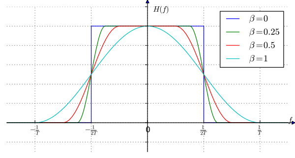

By the *Nyquist - Shannon Theorem*, the sampling rate should be at least twice the highest frequency component. This means that for $\beta = 1$ where the bandwidth has a maximum value of $1/T$, one must utilise a minimum sampling rate of $2/T$. In practice, however, oversampling is preferred with a *up-sample factor* of 8-10.

In MATLAB, I applied a *raised cosine filter* using:

```OCTAVE
hTxFilter = comm.RaisedCosineTransmitFilter;
hTxFilter.RolloffFactor = 0.25;
hTxFilter.FilterSpanInSymbols = 22;
hTxFilter.OutputSamplesPerSymbol = upsampleFactor;
b = coeffs(hTxFilter);
hTxFilter.Gain = 1 / sum(b.Numerator) * upsampleFactor;
txFiltered = hTxFilter(txSymbols);

fvtool(hTxFilter, 'Fs', sampleRate)
```


The magnitude response in *Figure 9* shows that this filter eliminates most of the high frequency, thus reducing the bandwidth required. To visualise the signal after it has passed the *pulse shaping* stage, I used an a *constellation diagram*, *eye diagram* and a *spectrum analyser*.

```OCTAVE
hConst.SamplesPerSymbol = 8;
release(hConst)
hConst(txFiltered)

groupDelay = order(hTxFilter)/2;

hEye = comm.EyeDiagram;
hEye.DisplayMode = 'Line plot';
hEye.SampleRate = sampleRate;
hEye.SamplesPerSymbol = upsampleFactor;
hEye.YLimits = [-1.5 1.5];
hEye.TracesToDisplay = 80;
hEye.ShowImaginaryEye = true;
hEye(txFiltered(groupDelay+1 : end));
```

```OCTAVE
hSpectrum = dsp.SpectrumAnalyzer(...
    'SampleRate', sampleRate, ...
    'SpectrumType', 'Power density', ...
    'PlotAsTwoSidedSpectrum', true, ...
    'RBWSource', 'Property', ...
    'RBW', 50, ...
    'SpectralAverages', 10, ...
    'Window', 'Hamming', ...
    'OverlapPercent', 20, ...
    'ReducePlotRate', false);
    hSpectrum(txFiltered);
```

The constellation diagram shows the "reference constellation" and where the symbols are actually mapped to. Notice that the symbols around the theoretical points, because the filter introduced additional noise. 

{width=50%}

The eye diagram acts like a constantly triggered oscilloscope, overlaying many traces of the signal to see its characteristics. It is primarily used to detect *ISI*, among many other signal quality parameters.

Finally, I analysed the spectrum of the filtered signal. It looks similar to the frequency response of the filter.

{width=60%}

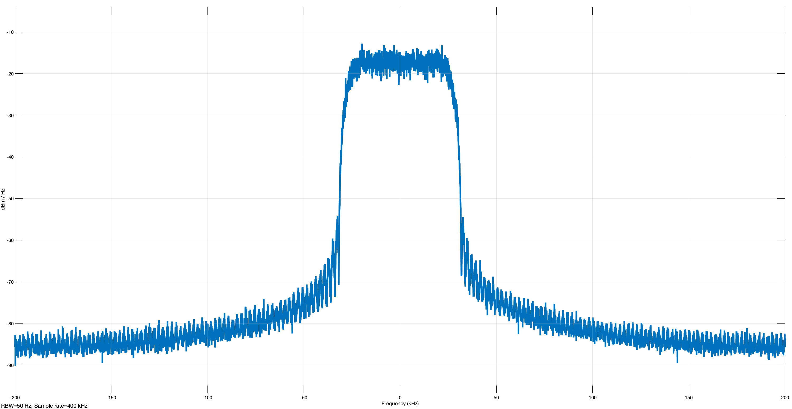{width=60%}

## Up-Conversion

To be able to transmit these filter symbols (the *complex baseband signal*) in the real world, one needs to embed them into a high-frequency carrier signal. This process is called *up-conversion* and can be visualised as follows:

{width=60%}

Let the *complex baseband signal* be represented as $z[n] = i[n] + jq[n]$. We can separate these signals $i[n]$ and $q[n]$ and convert them into their continuous counterparts $i(t)$ and $q(t)$ respectively. These are then multiplied by $cos$ and $sin$ signals with the carrier frequency, finally summing them to make up the resignal $s(t)$ which is going to be transmitted, also called *real bandpass signal*.

The code I used to generate this real bandpass signal is:

```OCTAVE
fc   = 100e3;
n    = (0 : (length(txFiltered) - 1))';
LO   = exp(1i * 2 * pi * fc * n / sampleRate);
txRF = real(txFiltered .* LO);
```

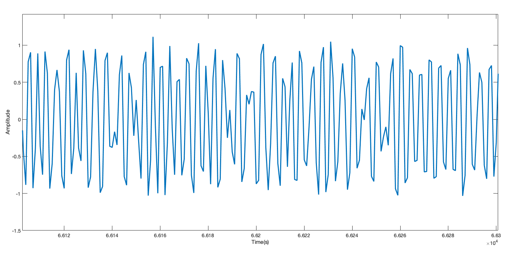

# The Receiver

While I have generated the *real bandpass signal* for illustrative purposes, there is actually no need to convert the complex symbols (the *complex baseband signal*) to its analog real bandpass counterpart in simulation. Running the simulations with the complex symbol values is much more efficient since one does not need a high frequency carrier signal which is computationally expensive.

The receiver part is mostly the reverse of the receiver part. The incoming *complex baseband signal* is filtered again by the matched *square root raised cosine filter* and then downsampled to directly yield the complex symbols. These symbols are then given to the demodulator, which outputs the 2-bit values of each corresponding symbol. This system can be visualised as:


This is the code I used to implement the receiver system.

```OCTAVE
hRxFilter = comm.RaisedCosineReceiveFilter;
hRxFilter.RolloffFactor = 0.25;
hRxFilter.FilterSpanInSymbols = 22;
hRxFilter.InputSamplesPerSymbol = upsampleFactor;
b = coeffs(hRxFilter);
hRxFilter.Gain = 1 / sum(b.Numerator);
rxSymbols = hRxFilter(txFiltered);

release(hConst)
groupDelay = order(hTxFilter)/2 + order(hRxFilter)/2;
hConst(rxSymbols(groupDelay+1 : end));

hDemod = comm.QPSKDemodulator('BitOutput',true);
rxBits = hDemod(rxSymbols);
```

## Bit Error Rate (BER) Calculation

I compared the received and the message bits:

```OCTAVE
groupDelay = order(hTxFilter)/2 + order(hRxFilter)/2;
filtDelay  = (groupDelay/upsampleFactor)*bitsPerSymbol;
figure(1)
subplot(2,1,1)
stairs(txBits(1:50), 'bo-')
axis([0 50 -0.5 1.5]);
title('\bfTx bits');
subplot(2,1,2)
stairs(rxBits(filtDelay+1 : filtDelay+50), 'bo-')
axis([0 50 -0.5 1.5]);
title('\bfRx bits');
```


As *Figure 16* shows, the transmitted and the received bits match perfectly. In general, one can quantify the quality of the transmission by calculating *Bit Error Rate(BER)*. This is simply a measure of how many bits were transmitted wrong, divided by the total number of bits transmitted.

By compensating for the fiter delays, I calculated the *BER* as follows:

```OCTAVE
delay = finddelay(txBits,rxBits);
hErrorRate = comm.ErrorRate('ReceiveDelay',delay);
BER = hErrorRate(txBits,rxBits)
```
This yields the output:

```OCTAVE

BER =

           0
           0
       99956
```

By the documentation, the class `comm.ErrorRate()` returns a "three element vector consisting of the error rate, followed by the number of errors detected and the total number of samples compared". Since this was a noiseless transmission (I haven't modeled the channel), the *BER* is $0$.

# Modeling Noise: AWGN (Additive White Gaussian Noise)

In wireless communication systems, the main source of noise is "addition of random signals arising from the vibration of atoms in the receiver electronics(3)"; which can be modeled with a mathematical construct called *AWGN (Additive White Gaussian Noise*). The noise is "additive", because it is "added" to the transmitted signal: this property is reflected in *Figure 17* as $r(t) = s(t) + n(t)$, where $r(t)$ is the received signal, $s(t)$ is the transmitted signal and $n(t)$ is the noise.

{width=40%}

It is termed "white" because it has a frequency-wise flat power spectrum density *(PSD)*. This means that it has a uniform power across the whole frequency band.

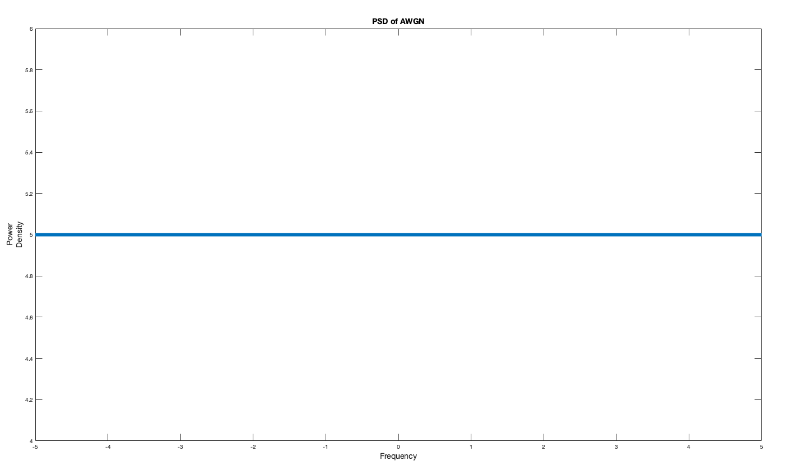{width=50%}

*Gaussian* refers to the probably distribution of the each noise sample: they are more likely to have closer to zero values, and the distribution has a zero mean: so the average of a large number of noise samples tends towards zero.

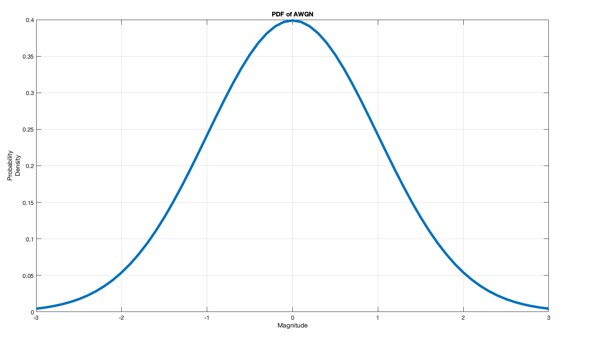{width=50%}

To model AWGN effects on a communication channel, I utilised a `AWGNChannel` system object:

```OCTAVE
hAWGN = comm.AWGNChannel('EbNo', EbNo, ...
                         'BitsPerSymbol', bitsPerSymbol, ...
                         'SamplesPerSymbol', upsampleFactor);
```

$E_b/N_0$ is the ratio of the energy per *bit* over noise power density. $E_b$ corresponds to the energy of each bit the transmitter sends, whereas $N_0$ corresponds to the noise energy per bit. This ratio is useful to determine a "normalised" SNR (Signal to Noise) ratio, independent from the bandwidth. This method helps compare the "BER performance" of different modulation and encoding schemes.

## BER Analysis

To measure the effectiveness of this communication scheme which uses QPSK modulation and square-root raised cosine filter in the presence of noise, I calculated the BER of the system in different `EbNo`'s from $0 dB$ to $6dB$ and plotted them on a *semi-log* scale. This is known as a *BER Curve* and is an important metric in measuring and comparing different communication systems. To achieve this I wrote a function called `qpskAWGN` which takes the `EbNo` and `totalBits` as inputs, transmits the message in $100.000$ bit packages and calculates the *BER* for the given `EbNo`. Here are the relevant parts of this function:

```OCTAVE
function ErrorRate = qpskAWGNFcn(EbNo, totalBits)
(...)
numBitsPerLoop = 1e5;
BER            = zeros(3,1);
while BER(3) < totalBits
    txBits = randi([0 1], numBitsPerLoop, 1);
    txSymbols = hMod(txBits);
    txFiltered = hTxFilter(txSymbols);
    txNoisy = hAWGN(txFiltered);
    rxSymbols = hRxFilter(txNoisy);
    rxBits = hDemod(rxSymbols);
    BER = hErrorRate(txBits, rxBits);
end
ErrorRate = BER(1);
end
```

Then a main script calls this function for `EbNo` values between `0` and `6dB`. 

```OCTAVE
EbNoVector = 0:6;
BERuncoded = zeros(1, length(EbNoVector));
numBitsPerSimulation = 1e6;

for ix = 1:length(EbNoVector)
    EbNo = EbNoVector(ix);
    disp(EbNo)
    BER = myqpskAWGNFcn(EbNo, numBitsPerSimulation);
    BERuncoded(ix) = BER(1);
end

semilogy(EbNoVector, BERuncoded, '-*')
grid on
xlabel('Eb/No (dB)');
ylabel('BER');
```

The resulting plot is shown in Figure 20.

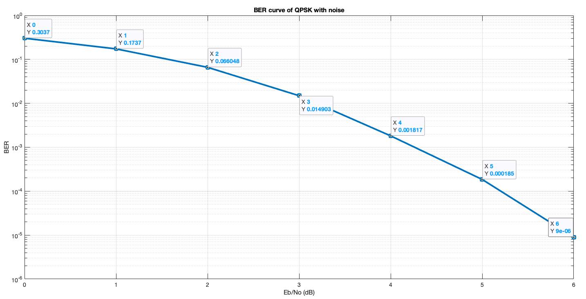

# Channel Coding

Channel coding is a technique used to improve the BER, i.e. to reduce the number of bits which are wrongly interpreted on the receiver side. This is done by generating extra bits and appending them to the packet sent. This redundant information about the data itself (such as checksums, message length...) is then used by the receiver to infer the contents of the received message and correct if any bits are wrong. Several coding techniques can be seen below.

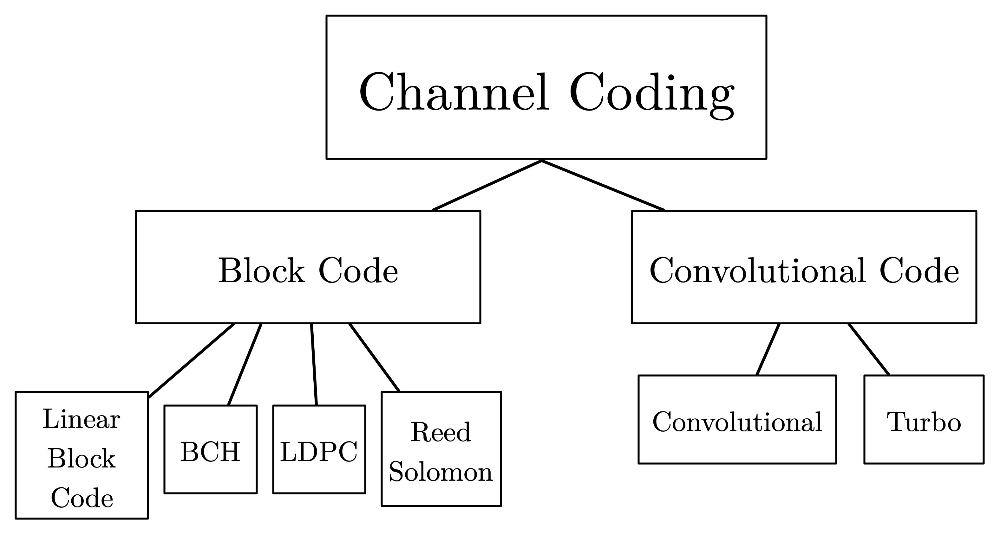{width=50%}

## Convolutional Code

Especially in wireless communication one of the most popular coding schemes is *convolutional code.* The important idea in convolutional coding is that each output bit of the channel encoder will depend on the current input bit and previous input bits. This introduces a "memory" in the encoder system: which can be exploited by the channel decoder to reduce the number of bit errors and improve the *BER*. A convolutional coding scheme is implemented by placing flip-flops in series to create a shift register and then summing chosen signals from the configuration to determine the output code. The number of flip-flops and the place of these "taps" is what characterises the implementation. As an example I used the 1/3 convolutional encoder used in the LTE physical layer standard(9), by the specification *3GPP TS 36.212*.


Since $G_0 = 133_7 = 1011011_2$, this means that the first bit of the output is the sum of the 1. 3. 4. 6. 7. pins because the `1 `s correspond the "taps". This can be visualised as follows:

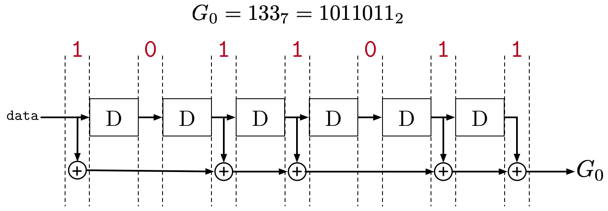

The "rate" is $1/3$ because for each input bit 3 output bits are produced in the encoder. This has a negative effect on data rate because now more bits are needed to send each message, however this also reduces BER and thus the tradeoff is justified. This shift register corresponds to a logical Mealy type finite state machine because the output bits depend on the input _and_ the current state. 

Apart from a state diagram, a *Trellis diagram* is also used to visualise the FSM. For instance, using a simpler encoder as shown in Figure 24:

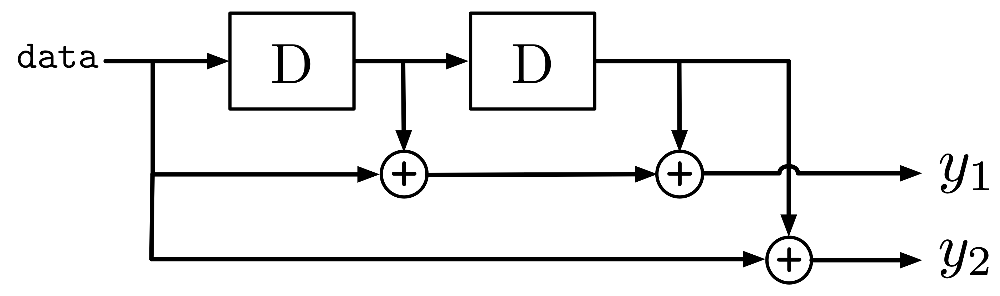{width=50%}

Given an input bitstream `[ 1 0 1 1 1 0 0 ]` the *Trellis diagram* for this encoder is:

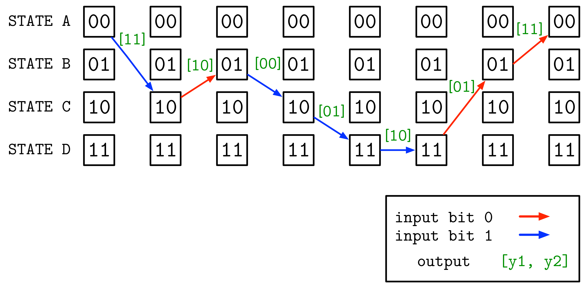{width=70%}

The Trellis diagram helps to visualise the operation of the encoder. Looking at the diagram we can see that for this particular 7-bit input stream the 14-bit output is `[ 1 1 1 0 0 0 0 1 1 0 0 1 1 1 ]`.

## Viterbi Algorithm

Decoding the convolutional code is conceptually more difficult than encoding it. A commonly used technique is called the *Viterbi algorithm*. Basically it includes the same FSM used in encoding the message to decode it. It finds the most likely input data which could generate the received codeword. Since the decoder does not directly know the states of the encoder but its outputs, it has to infer which states would produce this output. Mathematically, the received codeword is the *observation* and the original message is the *hidden state*.

## MATLAB Code

The convolutional encoder is coded using the system object:

```OCTAVE
hConvCoder = comm.ConvolutionalEncoder( ...
    'TrellisStructure', poly2trellis(7, [133 171 165]), ...
    'TerminationMethod', 'Terminated');
```

The octal representations $133_7, 171_7, 165_7$ are used to construct the encoder, as per the LTE specifications. Setting the `'TerminationMethod'` to `'Terminated'` tells the encoder to add extra bits to return all the flip-flops to `0`.

## BER Analysis

Using a similar setup to the previous section (with a main script calling the two functions with and without Convolutional coding), I compared the two BER curves.


As can be seen, at lower SNR values (where the noise is strong), Convolutional coding yields better results. At $(E_b/N_0)_{dB} = 0$, where $P_S$ is signal power and $P_N$ is noise power, $0 dB = log_{10}1 = 10.log_{10}(\frac{P_S}{P_N})$ which implies $\frac{P_S}{P_N} = 1$. This means the power of the noise per bit is equally strong as the power of the signal per bit. We see that at this point the *BER* without Convolutional coding is $0.3$ where as with Convolutional coding it is $0.07$. Without Convolutional coding, $30$ out of $100$ bits are received wrong, compared to $7$ bits with the Convolutional coding. This is a serious increase in terms of saving power, increasing effective distance and the reliability of communication in general.
