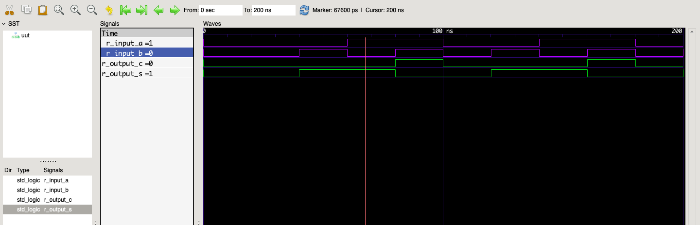

+++
title = "VHDL Simulation Workflow in macOS"
date = 2019-02-01T23:54:23+03:00
categories = ["VHDL"]
+++


The [XILINX Vivado Design Suite](https://www.xilinx.com/products/design-tools/vivado.html) does not work natively on the macOS platform, so you can not download your code to your development board. What you _can_ do, however, is to run simulations of your VHDL code. This post will show how to do it using `ghdl` and `gtkwave`.

# Requirements

## GHDL

The first thing you have to do is install [GHDL](https://github.com/ghdl/ghdl), which is *"the open-source compiler and simulator for VHDL"*. It can be downloaded from [the releases tab](https://github.com/ghdl/ghdl/releases) in their GitHub repo. The downloaded .tar archive will have `bin`, `include` and `lib` folders. After moving the contents of these files to somewhere in your `$PATH`, (for example `usr/local/bin`) you can check if the setup is working.

```bash
$~ which ghdl
/usr/local/bin/ghdl

$~ ghdl --version
GHDL 0.36-dev (20181129) [Dunoon edition]
 Compiled with GNAT Version: GPL 2017 (20170515-63)
 mcode code generator
Written by Tristan Gingold.

Copyright (C) 2003 - 2015 Tristan Gingold.
GHDL is free software, covered by the GNU General Public License.  There is NO
warranty; not even for MERCHANTABILITY or FITNESS FOR A PARTICULAR PURPOSE.
```

## gtkwave

To be able to view the resulting waveforms, you can use [gtkwave](http://gtkwave.sourceforge.net). On macOS systems, it can easily be installed via `brew cask install gtkwave`. After the installation is completed, _gtkwave.app_ will be available in your default _Applications_ folder.

# Simulation

Let's use a simple half-adder circuit coded in VHDL.

```vhdl
library ieee;
use ieee.std_logic_1164.all;

entity half_adder is
    port(
    A : in std_logic;
    B : in std_logic;
    S : out std_logic;
    C : out std_logic
    );
end half_adder;

architecture RTL of half_adder is
    begin
        S <= A XOR B;
        C <= A AND B;
end RTL;
```

To simulate this code, you will need a test-bench module. Here's an example:

```vhdl
library ieee;

use ieee.std_logic_1164.all;

entity half_adder_tb is
end entity;

architecture Behavioural of half_adder_tb is

    constant c_WAIT : time := 20 ns;
    signal r_input_a : std_logic := '0';
    signal r_input_b : std_logic := '0';
    signal r_output_s : std_logic := '0';
    signal r_output_c : std_logic := '0';

    component half_adder is
        port(
        A : in std_logic;
        B : in std_logic;
        S : out std_logic;
        C : out std_logic
        );

    end component half_adder;

    begin
        UUT : half_adder
        port map (
        A => r_input_a,
        B => r_input_b,
        S => r_output_s,
        C => r_output_c
        );

        p_comb : process is
            begin
                wait for c_WAIT;
                r_input_a <= '0';
                r_input_b <= '0';

                wait for c_WAIT;
                r_input_a <= '0';
                r_input_b <= '1';

                wait for c_WAIT;
                r_input_a <= '1';
                r_input_b <= '0';

                wait for c_WAIT;
                r_input_a <= '1';
                r_input_b <= '1';

            end process;

end Behavioural;
```

The files are named `half_adder.vhd` and `half_adder_tb.vhd`. To run the simulation, first you have to *analyse* and *elaborate* the source files.

```bash
ghdl -a half_adder.vhd
ghdl -e half_adder

ghdl -a half_adder_tb.vhd
ghdl -e half_adder_tb
```

Notice how the elaborate commands do not have the file extensions in their parameters. Finally, we can run the simulation and output the results in a _fst_ file to be opened by _gtkwave_.

```bash
ghdl -r half_adder_tb --stop-time=200ns  --fst=half_adder.fst
open half_adder.fst
```

The `open` command will launch _gtkwave_ and there you can see the waveform results of the simulation. Simply by dragging your signals from the left bar, you can observe them.



And there it is! You can now easily simulate your code in macOS before downloading it to your hardware.

## Extras

Running each specific `ghdl` command can be a bit tedious. You can write a simple `bash` script to automate some of the task. For example, the following script takes the main module name - _half_adder_ in this case - and a stop time for the simulation. I gave it the name _mhdl_, so I can simply run `mhdl half_adder 200ns`

```bash
#!/bin/bash

ghdl -a $1.vhd
ghdl -e $1

ghdl -a $1_tb.vhd
ghdl -e $1_tb

ghdl -r $1_tb --stop-time=$2 --fst=$1.fst

open $1.fst
```

# Downloads

[half_adder.vhd](files/half_adder.vhd)

[half_adder_tb.vhd](files/half_adder_tb.vhd)

[mhdl](files/mhdl)
