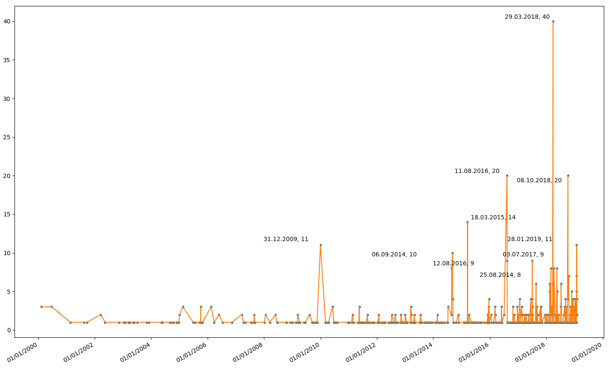

[Ekşi Sözlük](https://eksisozluk.com) (or "sourtimes") is an attempt at a *dictionary* or a *holy source of information* where users can create articles or post entries just about anything which comes to mind. It was created at 1999 by [Sedat 'ssg' Kapanoğlu](https://twitter.com/esesci) with inspiration from [Douglas Adams' The Hitchhiker's Guide to the Galaxy](https://en.wikipedia.org/wiki/The_Hitchhiker%27s_Guide_to_the_Galaxy). It is currently the most active "dictionary" style page in Turkey, so an interesting place to look from the perspective of data science.

Somewhere around the last two years, they have blocked access without cookies, so a simple python `request` will result in an aborted connection.

```python
>>> import requests as req
>>> r = req.get('https://www.eksisozluk.com')
    (...)
    requests.exceptions.ConnectionError: ('Connection aborted.', RemoteDisconnected('Remote end closed connection without response'))
```

This is why we will use `selenium` to automate a "headless" Google Chrome instance to scrape data from the website. We will be looking at a single article, and the number of entries entered by date. The point of interests are the dates in which the numebr of entries are the highest. They are likely to coincide with real-life events.

# Requirements

## Google Chrome

In this post I will be automating a Google Chrome browser instance. You can obviously choose another browser like Safari or Mozilla, but I have found that Chrome has the most intuitive support for browser automation. It can be downloaded from [the official webpage](https://www.google.com/chrome/).

## Selenium

[Selenium](https://selenium-python.readthedocs.io) is a toolkit to automate browsers. Since we will be using _Python_, we will need the _Python 3 API_. This package can be installed via `pip install selenium`.

## chromedriver

To automate Google Chrome using Selenium, you will also need the `chromedriver` binary. The latest releases can be found at their [downloads page](http://chromedriver.chromium.org/downloads). After extracting the zip file, you will have to put the `chromedriver` binary somewhere in your `$PATH` (for example `usr/local/bin`).

## Beautiful Soup

[Beautiful Soup](https://www.crummy.com/software/BeautifulSoup/) is an all-powerful parser which we will use to parse HTML data. It can be installed via `pip install beautifulsoup4`.

## matplotlib

[matplotlib](https://matplotlib.org) is an awesome 2D plotting library which we will use to visualize the data. It can similarly be installed via `pip install matplotlib`.

## adjustText

We will use this little library to make annotations look prettier in matplotlib (they tend to infuriatingly overlap). It can be installed via `pip install adjustText`, see the [GitHub page](https://github.com/Phlya/adjustText) for more information.

# Code

Ekşi Sözlük has "articles" and "entries". We will scrape the date data from the pages, to see when an article had the most entries written to it. I will not go through all the code line by line, but some of the more crucial concepts.

To automate a "headless" Google Chrome browser instance, we will need the absolute paths of the Google Chrome binary and the `chromedriver` binary. On a macOS system, the Google Chrome binary will likely to be located inside the application: `"/Applications/Google Chrome.app/Contents/MacOS/Google Chrome"` The `chromedriver` binary is wherever you have copied it in the installation step.

The code for a simple automation is as follows:

```python
from selenium import webdriver
from selenium.webdriver.chrome.options import Options

url = 'SOME.URL'
binary_path = "/Applications/Google Chrome.app/Contents/MacOS/Google Chrome"
chromedriver_path = "SOME/PATH"

chrome_options = Options()
chrome_options.add_argument("--headless")
chrome_options.binary_location = binary_path

driver = webdriver.Chrome(executable_path=chromedriver_path,
                          options=chrome_options)

driver.get(url)
print(driver.page_source)
```

This will print the html source of the URL.

In this particular example, after some exploration, I have seen that Ekşi Sözlük formats the entry dates in the form of `<a class="entry-date permalink" href="/entry/1">15.02.1999</a>`. To extract this using BeautifulSoup, you can do:

```python
content = driver.page_source
soup = BeautifulSoup(content, 'html.parser')
html_dates.append(soup.find_all("a", class_='entry-date permalink'))
```

To extract the real "date" from this string, I have used `regex`. Noting that the date format is in the form `\d\d.\d\d.\d\d\d\d`, you can do a `re.findall()` to get the exact date part. (See [Regular Expression HOWTO](https://docs.python.org/3/howto/regex.html)).

After creating a list of the dates, you can count their number of occurrences with a `Counter(list)`. To find the most N occurrences, use `most_common(N)`. Finally you can create an `OrderedDict` from this `Counter` object to be able to iterate over it. (Don't forget to import them from `collections`).

To create `datetime` objects from the string elements of this dictionary, you can use `datetime.datetime.strptime(date, '%d.%m.%Y')).` And then to convert it to a `date` object, simply add a `.date()`. (See [datetime — Basic date and time types](https://docs.python.org/3/library/datetime.html#module-datetime)). So this will look like:

```python
import datetime as dt
for date in dates_string:
    x.append(dt.datetime.strptime(date, '%d.%m.%Y').date())
```

Once you have a `x` list and an `entries` list which has the number of entries entered on that date, you can finally plot it using matplotlib.

```python
import matplotlib.pyplot as plt
import matplotlib.dates as mdates

from adjustText import adjust_text

fig, ax = plt.subplots()

plt.plot(x, entries, '.')

plt.gca().xaxis.set_major_formatter(mdates.DateFormatter('%d/%m/%Y'))
plt.gcf().autofmt_xdate()
plt.show()
```

Lastly, to be able to annotate the top N occurences (points of interest) we will use the result of the `most_common()` method.

```python
top_count = 10
texts = []

counted_dates = Counter(dates)
top = counted_dates.most_common(top_count)

for i in range(top_count):
    top_x, top_y = top[i]
    texts.append(plt.text(mdates.date2num(dt.datetime.strptime(str(top[i][0]), '%d.%m.%Y').date()),
                          top[i][1], str(top[i][0]) + ', ' + str(top[i][1]), ha='right', va='top'))

adjust_text(texts)
```

# Example

Running this script with [the article for python](https://eksisozluk.com/python--109286). We get the following graph:



Sadly, the peaks of this particular graph do not correspond to real-life important events (I had thought about the Python 3 release at 3 December 2008, for example). The peak at 29.03.2018 for 40 entries corresponds to a beef between multiple users, and the one at 31.12.2009 with 20 entries correspond to a discussion about [Python's usage of whitespace](http://wiki.c2.com/?PythonWhiteSpaceDiscussion). Regardless, it was still a nice exercise.

# Downloads

[eksi.py](files/eksi.py)

$\space$